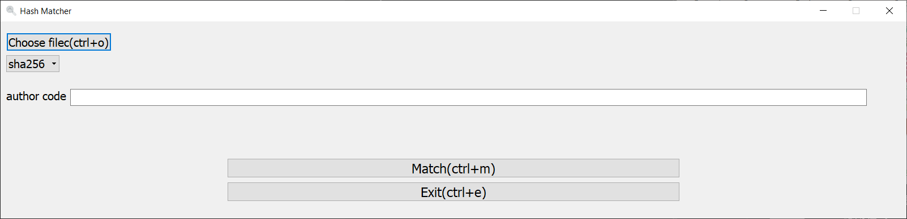

# Hash-matcher
Check if the file has been modified or the integrity of the file. 

※Notice: 
author code is author prviding hash code, look like this `3aaf70621ab0313b14259780d2c50334e23445fc8b27aae30f5b3be94fafad8b`.
## Usage
`python hash_matcher.py`

### hot keys: 
open file&ensp;: `ctrl+o` 
Match&ensp;&ensp;&ensp;: `ctrl+m` 
exit &ensp;&ensp;&ensp;&ensp;&ensp;: `ctrl+e` 